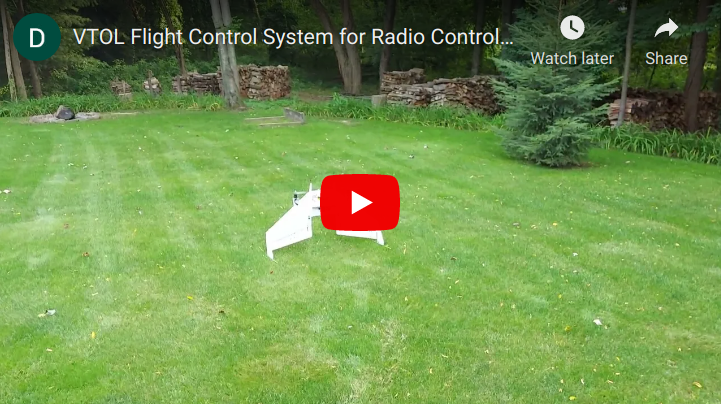

# About

I am currently working on a flight control system that will provide flight stabilization for VTOL aircraft. The system is built around the Raspberry Pi Pico microcontroller. The system uses onboard sensors and feedback loops to stabilize the aircraft in vertical flight. The unusual tail-sitter design simplifies the mechanical complexity and improves the durability of the aircraft.

